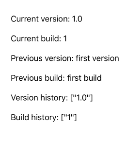

# VersionTrackerSwift

[](https://travis-ci.org/tbaranes/VersionTrackerSwift)

[](https://github.com/tbaranes/VersionTrackerSwift)
[](https://github.com/Carthage/Carthage)
[](http://cocoadocs.org/docsets/VersionTrackerSwift)

VersionTrackerSwift is a versions / builds tracker to know which version has been installed by a user. 



## Usage

In your ApplicationDelegate, call the method `track` to track the current version:

```swift
// iOS / tvOS
func application(application: UIApplication, didFinishLaunchingWithOptions launchOptions: [NSObject: AnyObject]?) -> Bool {
    VersionTracker.track()
    return true
}
```

```swift
// macOS
func applicationDidFinishLaunching(aNotification: NSNotification) {
    VersionTracker.track()
    return true        
}
```

Then, call whenever one of the following methods to get the data you need:

```swift
VersionTracker.shared.track() 
VersionTracker.shared.isFirstLaunchEver // Bool
VersionTracker.shared.isFirstVersionLaunch // Bool
VersionTracker.shared.isFirstBuildLaunch // Bool
VersionTracker.shared.versionHistory // [String]
VersionTracker.shared.buildHistory // [String]

VersionTracker.currentVersion // String
VersionTracker.currentBuild // String
```

Check out the examples and play with the version / build / number to have a concrete example.

### How it works?

Each time you call the method `track`, the version and build are stored in `NSUserDefaults` if a new version / build is detected. Then, you can access to any information from the tracker.

The version and build number are the information you specify in your app's Info.plist.
 
## Installation

### CocoaPods

Add the following line in your Podfile:

```
pod 'VersionTrackerSwift'
```

### Carthage

Add the following line to your Cartfile:

```
github "tbaranes/VersionTrackerSwift"
```

### Manual

Just drag the `Source/*.swift` files into your project.
 
## Contribution

- If you found a **bug**, open an **issue**
- If you have a **feature request**, open an **issue**
- If you want to **contribute**, submit a **pull request**

## Licence

VersionTrackerSwift is available under the MIT license. See the LICENSE file for more info.

